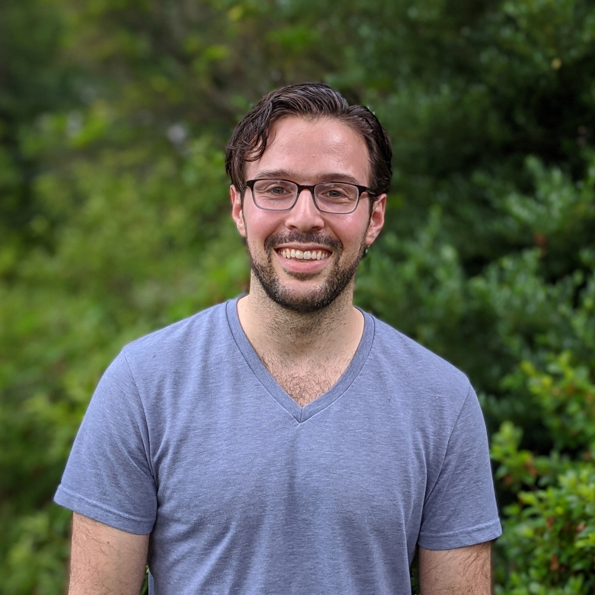
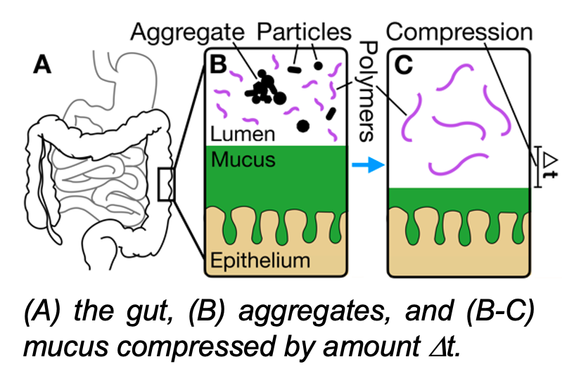
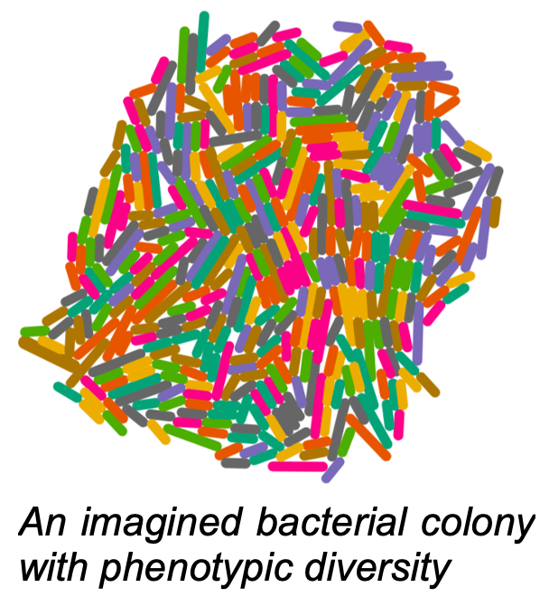

<head>
<title>Asher Preska Steinberg</title>
</head>
## Welcome

Hello! If you've stumbled upon this page, hopefully it means you are interested in my research. This is currently a work in progress, and I hope to have more up here soon.

## About Me

I am a postdoctoral researcher working with [Professor Edo Kussell](https://as.nyu.edu/faculty/edo-kussell.html) in the Biology Department at New York University. Currently, I am very fortunate to be a [Simons Fellow](https://www.simonsfoundation.org/life-sciences/simons-postdoctoral-fellowships-in-life-sciences/) of the [Life Sciences Research Foundation](http://www.lsrf.org/). Prior to working with Edo, I spent 5+ mind-bending years doing my PhD at Caltech under the mentorship of [Rustem Ismagilov](https://ismagilovlab.caltech.edu/).

## Research Interests

Biophysics, soft matter physics, polymer physics, computational biology, and evolution

## Research Summary

**Can we use physics to predict how polymers in our diet shape gut environment?**

During my [PhD thesis work](https://thesis.library.caltech.edu/11474/), I focused on elucidating how polymers in the human diet influence gut structure and function through physicochemical interactions. The human gut abounds in both secreted polymers (e.g., mucus, proteins) and ingested polymers (e.g., dietary fibers, food additives, therapeutics). These polymers affect the composition of the gut microbiome and diseases such as inflammatory bowel disease, yet the underlying physics by which these polymers alter gut physiology is not well understand. We studied this through a combination of experiments and numerical calculations. Despite the complexity of the gut, we were able to develop a coarse-grained, statistical physics approach for understanding how dietary polymers impact physiology, which enabled quantitative predictions based on measurables such as polymer size and concentration. Specifically, we found that dietary polymer-induced osmotic forces can compress colonic mucus and influence the aggregation of particles in the gut (Publications 2-4). Both mucus compression and aggregation have implications regarding altered protection against pathogens and drug uptake. Overall, my thesis work with the Ismagilov Lab yielded a quantitative, biophysical understanding of how polymer-driven osmotic forces, which shape gut physiology, can be tuned by host, microbiota, and diet.

**How do fluctuating, biopolymeric environments influence microbial adaptation and behavior?**

As the gut microbiota has a profound effect on human health, a complete understanding of how dietary polymers influence gut function must incorporate a quantitative framework for how microbes adapt to and behave in environments where conditions are constantly in flux and polymer-rich (e.g., gut, lungs). I began working on this at the end of my PhD with work focusing on how polymer-driven osmotic forces influence the aggregation of motile bacteria (Publication 1). I am now working with Edo Kussell to understand how microbes have adapted to live in these fluctuating, biopolymeric environments by leveraging diversity-generating mechanisms such as stochastic switching (i.e., phenotypic diversity) and recombination (i.e., genetic diversity).

## Education

 **California Institute of Technology**  
 Ph.D. in Chemistry, Apr 2019 
 Thesis advisor: Rustem F. Ismagilov 
 Thesis committee: Zhen-Gang Wang (chair), David A. Tirrell, Julie A. Kornfield  
 Thesis: *How polymers shape the physicochemical environment of the gut*  
 Thesis awarded Herbert Newby McCoy Award by Division of Chemistry & Chemical Engineering at Caltech

 **Brandeis University**  
 B.A. in Chemistry with highest honors, B.A. in Physics (*summa cum laude*), May 2013 
 Thesis advisor: Milos Dolnik  
 Thesis: *Growth dynamics of Turing Patterns in the photosensitive CDIMA reaction*  

## Publications

*For hyperlinks to publications, see my Google Scholar [here](https://scholar.google.com/citations?user=yQnF_RQAAAAJ&hl=en&oi=ao).* 

1.	M. K. Porter, **A. Preska Steinberg**, R. F. Ismagilov. “Interplay of motility and polymer-driven depletion forces in the initial stages of bacterial aggregation”. Soft Matter 2019, 15, 7071-7079.
7.	**A. Preska Steinberg**, Z. G. Wang, R. F. Ismagilov. “Food polyelectrolytes compress the colonic mucus hydrogel by a Donnan mechanism”. Biomacromolecules 2019, 20 (7), 2675-2683.
6.	**A. Preska Steinberg**, S. S. Datta, T. Naragon, J. C. Rolando, S. R. Bogatyrev, R. F. Ismagilov. “High-molecular-weight polymers from dietary fiber drive aggregation of particulates in the murine small intestine”. eLife 2019, 8:e40387.
5.	S. S. Datta, **A. Preska Steinberg**, R. F. Ismagilov. “Polymers in the gut compress the colonic mucus hydrogel”. Proc Natl Acad Sci USA 2016, 113 (26), 7041-7046.
4.	L. Haim, A. Hagberg, R. Nagao, **A. Preska Steinberg**, M. Dolnik, I. R. Epstein, E. Meron. “Fronts and patterns in a spatially forced CDIMA reaction”. Phys Chem Chem Phys 2014, 16 (47), 26137-26143.
3.	**A. Preska Steinberg**, I. R. Epstein, M. Dolnik. “Target Turing Patterns and Growth Dynamics in the Chlorine Dioxide-Iodine-Malonic Acid reaction”. J Phys Chem A 2014, 118 (13), 2393-2400.
2.	E. S. Thrall, **A. Preska Steinberg**, X. Wu, L. E. Brus. “The Role of Photon Energy and Semiconductor Substrate in the Plasmon-Mediated Photooxidation of Citrate by Silver Nanoparticles”. J Phys Chem C 2013, 117 (49), 26238-26247.
1.	J. Palacci, S. Sacanna, **A. Preska Steinberg**, D. J. Pine, P. M. Chaikin. “Living Crystals of Light-Activated Colloidal Surfers”. Science 2013, 339 (6122), 936-940.

## Selected Honors, Awards, Fellowships

Year | Award | Description
-----|-------|--------
2020-present | LSRF Postdoctoral Fellowship  | Simons Foundation Awardee of the [Life Sciences Research Foundation](http://www.lsrf.org/)
2019 | Herbert Newby McCoy Award | In recognition of the most outstanding achievements in research by a graduate student in Caltech Chemistry & Chemical Engineering 
2018-2019 | Caldwell CEMI Fellowship | Awarded by Caltech [CEMI](http://microbiology.caltech.edu/index.html) to graduate students doing exciting interdisciplinary research that has the potential to benefit society
2013-2018 | NSF GRFP | National Science Foundation Graduate Research Fellowship Program ([link](https://www.nsfgrfp.org/))
2013 | Schiff Memorial Award | Awarded by the Brandeis Division of Science to one or more student showing creativity and originality in science, fine arts or archeology ([link](https://www.brandeis.edu/science/prizes-awards/index.html))

## Contact

* Email: [apsteinberg@nyu.edu](mailto:apsteinberg@nyu.edu)
* Social media: [LinkedIn](https://www.linkedin.com/in/asher-preska-steinberg-38b22866/)
